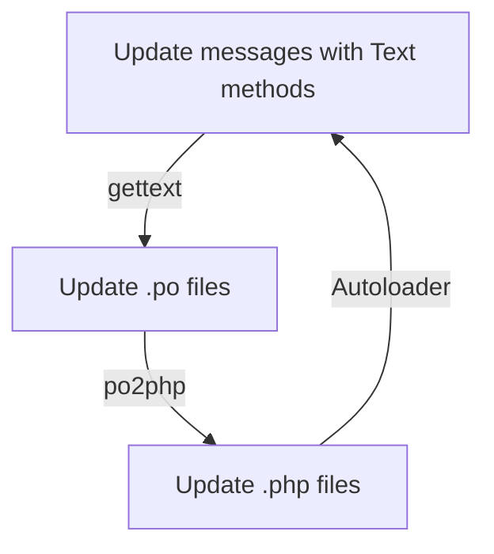

# text

Translation library based on concept of [gettext](https://www.gnu.org/software/gettext) PO files.

## Description

This class is intended to eliminate the dependency on `gettext` php extension, proved unstable in web environments.

The existing PO catalogue (representing a gettext domain) is transformed by the `po2php` tool to a native `.php` class
that does not need any runtime preprocessing to load translations into memory. This inherits from `Vertilia\Text\Text`
and contains all translated domain messages into target language, and also the plural forms rules.

Simple messages are maintained via the `_()` method, plural forms and contexts are maintained via corresponding
`nget()`, `pget()` and `npget()` methods.

## Advantages

> **From manual:**
> 
> GNU `gettext` is designed to minimize the impact of internationalization on program sources, keeping this impact as
> small and hardly noticeable as possible. Internationalization has better chances of succeeding if it is very light
> weighted, or at least, appear to be so, when looking at program sources.

- no need to use constants or other intermediate constructs replacing messages in source code;
- handling of plural forms and context-based translations;
- use of standard translation process based on PO files, multitude of editors or processes may be used;
- translations are stored in `.php` files which allows for a quick autoloading and opcode caching, minimized runtime
  effort to get translation into memory;
- stable and predictable work in multiprocess web environments, not tied to currently installed system locales.

## Usage

Programming in c with gettext historically consists of the following phases (simplified):

1. define the source messages language used in your code (normally english)
2. use gettext functions in your source code when using localized messages
   - (without existing translations, gettext functions simply return the passed strings, so the code is already
     working at this stage, returning english messages in all environments)
3. use gettext command line utilities to scan your code and extract localized messages, producing (or updating) `.po`
   text files
   - (`.po` text files contain messages extracted from code, translations to the target language and rules for plural
     forms of the target language)
4. translate new/updated messages in `.po` file
5. compile text `.po` file into binary `.mo` file
6. copy `.mo` file into your code, so that now gettext functions could use them to extract translations for their
   arguments
7. return to 2.

In `Text` we bypass phases 5. and 6. that process and handle compressed binary format to avoid complex operations at
runtime, and compile `.po` files directly into `.php` classes, containing translated strings and plural forms rules for
target language.

These generated classes are stored in `locale/` folder and are configured via composer autoloader. They are handled by
opcode cache just like other php code and use the lowest footprint at runtime since only need one CRC32 transformation
to return existing translation (or a lack of one).

For large codebases, as with normal gettext, you can break down translations on domains, which mostly signifies using
different `.po` files per domain.

When you start the project, and while you have no `.po` file yet, you can use the base `\Vertilia\Text\Text` object to
provide translated text. It will simply return the passes argument as translated message, which is mostly ok for
debugging purposes. Even in its basic form, it will already be smart enough to correctly handle plural forms for English
messages.

```php
<?php

require_once __DIR__ . 'vendor/composer/autoload.php';

$t = new \Vertilia\Text\Text();

echo $t->_('Just a test'), PHP_EOL;                      // output: Just a test
echo $t->pget('page', 'Next'), PHP_EOL;                  // output: Next
echo $t->nget('One page', 'Multiple pages', 1), PHP_EOL; // output: One page
echo $t->nget('One page', 'Multiple pages', 5), PHP_EOL; // output: Multiple pages
echo $t->npget('page', 'One sent', 'Multiple sent', 5), PHP_EOL; // output: Multiple sent
```

When you process the above code with gettext tools (we highly recommend using widely-available translation tools, like
[Poedit](https://poedit.net/) or others) you'll produce a text file with `.po` extension with source language messages
and placeholders for target language translations, say French. After translating the placeholders in `.po` file, you
normally include the result file in your project as `locale/fr/LC_MESSAGES/messages.po`. This is a GNU norm, but of
course you may use any folder and filename. The most important part here is that you (and other users of your codebase)
could easily locate translation files and clearly distinguish languages and domains.

> See [Keywords for `xgettext`](#keywords-for-xgettext) below for things to configure when running gettext tools on your
> codebase.

Simplified view of the contents of `messages.po` file for our project:

| source (en)                       | target (fr)          |
|-----------------------------------|----------------------|
| "Just a test"                     | "Juste un test"      |
| "Next" (context: "page")          | "Suivante"           |
| "One page"                        | "Une page"           |
| "Multiple pages"                  | "Plusieurs pages"    |
| "One sent" (context: "page")      | "Une envoyée"        |
| "Multiple sent" (context: "page") | "Plusieurs envoyées" |
| `plural form rule`                | `(n > 1)`            |

Don't forget where you stored the resulting `messages.po` file, since you'll need it right away to produce translations
class. To do this you'll run the bundled `bin/po2php` command and give it the path to the `messages.po` file. It will
output the php code that you will include in your project as an easily located `locale/MessagesFr.php` file.

So for now, you added 2 additional files to your project:

- `locale/fr/LC_MESSAGES/messages.po`: text file with English source messages from your application code, French
  translations for every message and a (not so) simple rule that describes the use of plural form(s) in target language,
  French. You will need this file to update existing translations, add new ones and remove unused ones. This is a
  standard PO file that you may edit with many available tools. Every translation bureau will handle this format (if it
  does not, you better choose another one).
- `locale/MessagesFr.php`: php class that encapsulates translations for target language and a method for handling French
  plural forms.

Now it's time to use the generated `MessagesFr` class instead of the base `Text` to display your translated messages:

```php
<?php

require_once __DIR__ . 'vendor/composer/autoload.php';

$t = new \App\Locale\MessagesFr();

echo $t->_('Just a test'), PHP_EOL;                      // output: Juste un test
echo $t->pget('page', 'Next'), PHP_EOL;                  // output: Suivante
echo $t->nget('One page', 'Multiple pages', 1), PHP_EOL; // output: Une page
echo $t->nget('One page', 'Multiple pages', 5), PHP_EOL; // output: Plusieurs pages
echo $t->npget('page', 'One sent', 'Multiple sent', 5), PHP_EOL; // output: Plusieurs envoyées
```

> See [Proposed configuration for `composer` and `git`](#proposed-configuration-for-composer-and-git) below for sample
> composer configuration.

Now it's up to you to create translations for other languages. From now on, your localization process with `Text` will
follow the following path:


## Process overview

`Vertilia\Text\Text` object contains methods to handle translated messages. Base class does not have translations, so
its methods simply return passed arguments. When translations are added to `.po` files, they are saved as language
classes extending `Vertilia\Text\Text` base class with translations and overridden `plural()` method to select
correct plural forms in target languages.

Normally your code will consist of injecting `Vertilia\Text\TextInterface` objects, creating messages and work with
external PO editor program to extract messages from code, handle translations in `.po` files and update language
classes.

## `Text` reference

### `Text::_()`

Translate message

```php
public function _(string $message): string;
```

#### Parameters
- `$message` Message in source language to translate.

#### Return value
Message translated to target language (or original message if translation not found).

#### Example 1: base class, no translation
```php
$t = \Vertilia\Text\Text();
echo $t->_("Several words"); // output: Several words
```

#### Example 2: `MessagesRu` class created after translating `messages.po` into Russian
```php
$t = \App\Locale\MessagesRu();
echo $t->_("Several words"); // output: Несколько слов
```

### `Text::nget()`

Translation for plural form of the message, based on argument.

```php
public function nget(string $singular, string $plural, int $count): string;
```

#### Parameters
- `$singular` Singular form of message in source language.
- `$plural` Plural form of message in source language.
- `$count` Counter to select the plural form.

#### Return value
One of plural forms of translated message in target language for provided `$count`.

#### Example 1: base class, no translation
```php
$t = \Vertilia\Text\Text();
printf($t->nget("%u word", "%u words", 1), 1); // output: 1 word
printf($t->nget("%u word", "%u words", 2), 2); // output: 2 words
printf($t->nget("%u word", "%u words", 5), 5); // output: 5 words
```

#### Example 2: `MessagesRu` class created after translating `messages.po` into Russian
```php
$t = \App\Locale\MessagesRu();
printf($t->nget("%u word", "%u words", 1), 1); // output: 1 слово
printf($t->nget("%u word", "%u words", 2), 2); // output: 2 слова
printf($t->nget("%u word", "%u words", 5), 5); // output: 5 слов
```

### `Text::npget()`

Translate plural form of the message in given context, based on argument.

```php
public function npget(string $context, string $singular, string $plural, int $count): string;
```

#### Parameters
- `$context` Context of message in source language.
- `$singular` Singular form of message in source language.
- `$plural` Plural form of message in source language.
- `$count` Counter to select the plural form.

#### Return value
One of plural forms of translated message in target language and context for provided `$count`.

#### Example 1: base class, no translation
```php
$t = \Vertilia\Text\Text();
printf($t->npget("star", "%u bright", "%u bright", 1), 1); // output: 1 bright
printf($t->npget("star", "%u bright", "%u bright", 2), 2); // output: 2 bright
printf($t->npget("star", "%u bright", "%u bright", 5), 5); // output: 5 bright
```

#### Example 2: `MessagesRu` class created after translating `messages.po` into Russian
```php
$t = \App\Locale\MessagesRu();
printf($t->npget("star", "%u bright", "%u bright", 1), 1); // output: 1 яркая
printf($t->npget("star", "%u bright", "%u bright", 2), 2); // output: 2 яркие
printf($t->npget("star", "%u bright", "%u bright", 5), 5); // output: 5 ярких
```

### `Text::pget()`

Translate the message in given context.

```php
public function pget(string $context, string $message): string;
```

#### Parameters
- `$context` Context of the message in source language.
- `$message` Message in source language to translate.

#### Return value
Translated message in target language and context.

#### Example 1: base class, no translation
```php
$t = \Vertilia\Text\Text();
printf($t->npget("star", "It's bright")); // output: It's bright
```

#### Example 2: `MessagesRu` class created after translating `messages.po` into Russian
```php
$t = \App\Locale\MessagesRu();
printf($t->npget("star", "It's bright")); // output: Она яркая
```

## Keywords for `xgettext`

To allow `xgettext` to extract messages from `Text` methods that replace classic gettext functions, the
following configuration should be provided for `xgettext` command line utility:
```
xgettext ... --keyword=_ --keyword=pget:1c,2 --keyword=nget:1,2 --keyword=npget:1c,2,3
```

GUI utilities like Poedit will provide a configuration screen where the keywords may be specified as the following list:

- `_`
- `pget:1c,2`
- `nget:1,2`
- `npget:1c,2,3`

## Proposed configuration for `composer` and `git`

When producing `Text` classes we recommend you to store them in `locale/` folder of your application. Consider the
following layout (simplified, 3 languages):
```
/app/
|-- locale/
|   |-- MessagesEn.php
|   |-- MessagesFr.php
|   `-- MessagesRu.php
|-- locale-dev/
|   |-- en/
|   |   `-- messages.po
|   |-- fr/
|   |   `-- messages.po
|   `-- ru/
|       `-- messages.po
|-- src/
|   `-- index.php
|-- vendor/
|   `-- composer/
|-- .gitattributes
`-- composer.json
```

Here, your application code is located in `src/` folder and, presuming the application namespace is `App`, messages
classes namespace is `App\Locale`, your composer `autoload` directive is configured as follows:
```json
{
  "autoload": {
    "psr-4": {
      "App\\": "src/",
      "App\\Locale\\": "locale/"
    }
  }
}
```

Please note, `locale-dev/` folder storing `.po` files is separated from `locale/` folder with `Text` message classes to
simplify exclusion of this folder from the binary version of your application. You don't need intermediate files on
production hosts, so you will most likely include the following line into your `.gitattributes`:
```
/locale-dev export-ignore
```

## `po2php` reference

```shell
$ po2php --help
Usage: po2php [OPTIONS] messages.po
OPTIONS:
-n, --namespace=NAMESPACE   Namespace to use (default: none)
-c, --class=CLASS_NAME      Class name (default: Messages)
-e, --extends=PARENT_CLASS  Parent class name implementing \Vertilia\Text\TextInterface
                            (default: \Vertilia\Text\Text)
-5, --php5                  Produce php5-compatible code (use php5 branch of Text)
-h, --help                  Print this screen
```

#### Example: generate `MessagesRu` catalog in `tests/locale`

```shell
$ bin/po2php -n Vertilia\\Text\\Tests\\Locale -c MessagesRu tests/locale/ru/messages.po >tests/locale/MessagesRu.php
```

## Plural forms in different languages

The plural form selector, incorporated into PO files, is in fact a C language code snippet that returns a 0-based index
of a plural form. In most cases this code translates to php in quite a straightforward way, like in example below:
```
# English, nplurals = 2
(n != 1)
```
Germanic-family languages like English or German only have 2 plural forms and every number which is not 1 is actually a
plural:

| example | plural form |
|---------|-------------|
| 0 lines | 0           |
| 1 line  | 1           |
| 2 lines | 1           |
| 3 lines | 1           |

Other language families may contain a more complex condition:
```
# Russian, nplurals = 3
(n%10==1 && n%100!=11 ? 0 : n%10>=2 && n%10<=4 && (n%100<12 || n%100>14) ? 1 : 2)
```
```
# Russian (alternative form), nplurals = 3
(n%10==0 || n%10>4 || (n%100>=11 && n%100<=14) ? 2 : n%10 != 1)
```
Slavic-family languages like Russian or Serbian have 3 plural forms, which are close to impossible to describe in one
phrase. Single form is for every number that terminates by 1 (but not by 11). First plural form is for numbers
terminated by 2, 3 or 4 (but not by 12, 13 or 14). All the rest (including 0, 11, 12, 13 and 14) are second plural form.
Examples:

| example    | plural form |
|------------|-------------|
| 0 строк    | 2           |
| 1 строка   | 0           |
| 2 строки   | 1           |
| 5 строк    | 2           |
| 10 строк   | 2           |
| 11 строк   | 2           |
| 12 строк   | 2           |
| 15 строк   | 2           |
| 20 строк   | 2           |
| 21 строка  | 0           |
| 22 строки  | 1           |
| 25 строк   | 2           |
| 100 строк  | 2           |
| 101 строка | 0           |
| 102 строки | 1           |
| 105 строк  | 2           |

You can find more examples at [gettext manual](https://www.gnu.org/software/gettext/manual/html_node/Plural-forms.html).

## Plural forms rules rewrite for specific languages

Ternary condition statement in php before version 8.0 has other associativity than in C, so the default rule in PO file
for languages using chained ternary operators for plural form selector needs to be corrected with additional parenthesis
in PO file:
```
# Russian (php7-compat), nplurals = 3
(n%10==1 && n%100!=11 ? 0 : (n%10>=2 && n%10<=4 && (n%100<12 || n%100>14) ? 1 : 2))
```
```
# Russian (php7-compat alternative form), nplurals = 3
(n%10==0 || n%10>4 || (n%100>=11 && n%100<=14) ? 2 : (n%10 != 1))
```

## Plural forms usage with `sprintf()`

For detailed discussion see [gettext manual](https://www.gnu.org/software/gettext/manual/html_node/Plural-forms.html).

## Class methods replacement for gettext functions

| `gettext` function | `Text` method |
|--------------------|---------------|
| `_()`, `gettext()` | `_()`         |
| `ngettext()`       | `nget()`      |
| `pgettext()`       | `pget()`      |
| `npgettext()`      | `npget()`     |

## Resources

- GNU gettext manual:
  https://www.gnu.org/software/gettext/manual/gettext.html
- POedit translations editor:
  https://poedit.net/
- .gitattributes:
  https://git-scm.com/docs/gitattributes#_creating_an_archive