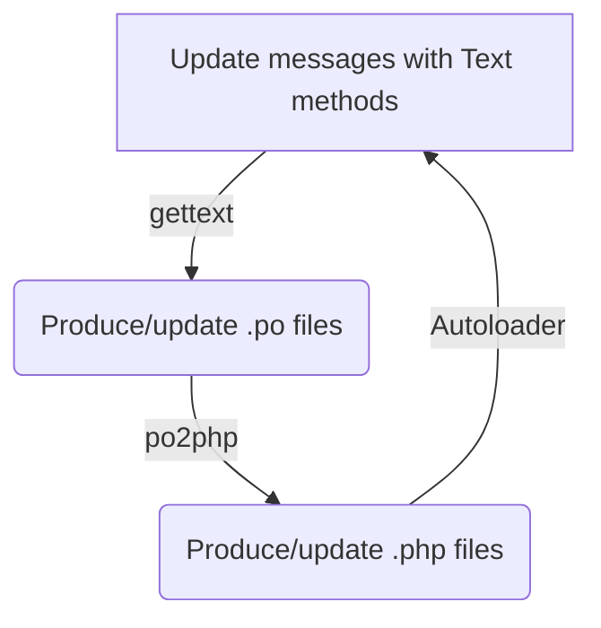

# text

Translation library based on concept of [gettext](https://www.gnu.org/software/gettext) PO files.

This class is intended to eliminate the dependency on `gettext` php extension, proved unstable in web environments.

The existing PO catalogue (representing a gettext domain) is transformed by the `po2php` tool to a native `.php` class
that does not need any runtime preprocessing to load translations into memory. This inherits from `Vertilia\Text\Text`
and contains all translated domain messages into target language, and also the plural forms rules.

Simple messages are maintained via the `_()` method, plural forms and contexts are maintained via corresponding
`nget()`, `pget()` and `npget()` methods.

## Usage

Programming in c with gettext historically consists of the following phases (simplified):

1. define the source messages language used in your code (normally english)
2. use gettext functions in your source code when referencing localized messages
   - (without existing translations, gettext functions simply return the passed strings, so the code is already
     working at this stage, returning english messages in all environments)
3. use gettext command line utilities to scan your code and extract localized messages, producing (or updating) `.po`
   text files
   - (`.po` text files contain messages extracted from code, translations to the target language and rules for plural
     forms of the target language)
4. translate new/updated messages in `.po` file
5. compile text `.po` file into binary `.mo` file
6. copy `.mo` file into your code, so that now gettext functions could use them to extract translations for their
   arguments
7. return to 2.

In `Text` we bypass storing translations in compressed binary format to avoid complex operations at runtime, and
compile `.po` files directly into `.php` classes, containing translated strings and plural forms rules for target
language.

These classes are stored in `locale/` folder and are configured via composer autoloader.

So now you can use this in your code:

| method    | code (precondition: `$t = new \Vertilia\Text\Text();`) | output           |
|-----------|--------------------------------------------------------|------------------|
| `_()`     | `echo $t->_('Just a test');`                           | `Just a test`    |
| `pget()`  | `echo $t->pget('page', 'Next');`                       | `Next`           |
| `nget()`  | `echo $t->nget('One page', 'Multiple pages', 5);`      | `Multiple pages` |
| `npget()` | `echo $t->npget('page', 'One', 'Multiple', 5);`        | `Multiple`       |

When you process the above code with gettext tools (we highly recommend using widely-available translation tools, like
[Poedit](https://poedit.net/)) you'll produce a text `messages.po` file with target language translation, say French.
Your result file will be stored as `locale/fr/messages.po` and will contain French translations for all messages
extracted from your sources.

For the above example, you'll have the following translations:

| source (en)                       | target (fr)          |
|-----------------------------------|----------------------|
| "Just a test"                     | "Juste un test"      |
| "Next" (context: "page")          | "Suivante"           |
| "One page"                        | "Une page"           |
| "Multiple pages"                  | "Plusieurs pages"    |
| "One sent" (context: "page")      | "Une envoyée"        |
| "Multiple sent" (context: "page") | "Plusieurs envoyées" |

Now you will use the `po2php` tool to compile the `locale/fr/messages.po` into a `MessagesFr` class extending
`\Vertilia\Text\Text` so that in the code you can see the results of your translations:

| method    | code (precondition: `$t = new \App\Locale\MessagesFr();`) | output               |
|-----------|-----------------------------------------------------------|----------------------|
| `_()`     | `echo $t->_('Just a test');`                              | `Juste un test`      |
| `pget()`  | `echo $t->pget('page', 'Next');`                          | `Suivante`           |
| `nget()`  | `echo $t->nget('One page', 'Multiple pages', 5);`         | `Plusieurs pages`    |
| `npget()` | `echo $t->npget('page', 'One sent', 'Multiple sent', 5);` | `Plusieurs envoyées` |

From now on, your `Text` process will follow the path as described below:


## `Text` reference

## `po2php` reference

## Proposed configuration for `composer` and `git`

When producing `Text` classes we recommend you to store them in `locale/` folder of your application. Consider the
following layout (simplified, 3 languages):
```
- locale/
  MessagesEn.php
  MessagesFr.php
  MessagesRu.php
- locale-dev/
  - en/
    messages.po
  - fr/
    messages.po
  - ru/
    messages.po
- src/
  index.php
- vendor/
  - composer/
.gitattributes
composer.json
```

Here, your application code is located in `src/` folder and, presuming the application namespace is `App`, messages
classes namespace is `App\Locale`, your composer `autoload` directive is configured as follows:
```json
{
  "autoload": {
    "psr-4": {
      "App\\": "src/",
      "App\\Locale\\": "locale/"
    }
  }
}
```

Please note, `locale-dev/` folder storing `.po` files is separated from `locale/` folder with `Text` message classes to
simplify exclusion of this folder from the binary version of your application. You don't need intermediate files on
production hosts, so you will most likely include the following line into your `.gitattributes`:
```
/locale-dev export-ignore
```

## Plural forms usage with `sprintf()` calls

## Plural forms rules rewrite for specific languages

## Keywords for `xgettext`

To allow `xgettext` to extract messages from `Text` methods that replace classic gettext functions, the
following configuration should be provided for `xgettext` command line utility:
```
xgettext ... --keyword=_ --keyword=pget:1c,2 --keyword=nget:1,2 --keyword=npget:1c,2,3
```

GUI utilities like Poedit will provide a configuration screen where the keywords may be specified as the following list:

- `_`
- `pget:1c,2`
- `nget:1,2`
- `npget:1c,2,3`

## Class methods replacement for gettext functions

| `gettext` function | `Text` method |
|--------------------|---------------|
| `_()`, `gettext()` | `_()`         |
| `ngettext()`       | `nget()`      |
| `pgettext()`       | `pget()`      |
| `npgettext()`      | `npget()`     |

## Resources

- GNU gettext manual:
  https://www.gnu.org/software/gettext/manual/gettext.html
- POedit translations editor:
  https://poedit.net/
- .gitattributes:
  https://git-scm.com/docs/gitattributes#_creating_an_archive